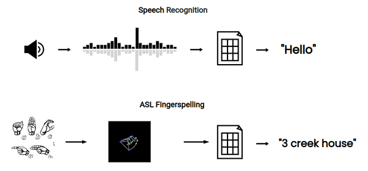
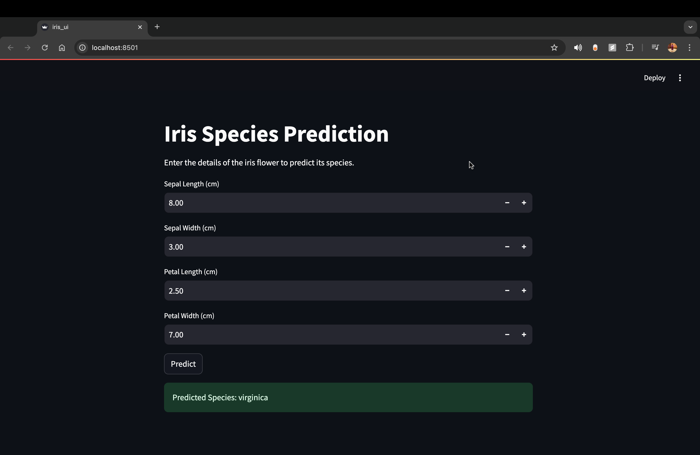

# Portfolio
---

M.S., Applied Science (AI/ML, Robotics) - University at Buffalo  _(May 2024)_  

B.E., Computer Engineering - Pune University, India  _(May 2021)_

---

# Work Experience
**Research Assistant @ University at Buffalo, SUNY   (_August 2024 - Present_)**
- Designed a neural network combining convolutional layers for feature extraction, and LSTMs for temporal analysis, achieving 72% accuracy in predicting the stage of Parkinson.
- Created a structured dataset from 15 diverse tests, integrating data from the National Institute of Health, USC.
- Developed personalized treatment plans, leveraging insights from model predictions and integrating SHAP (SHapley Additive exPlanations) for transparency in decision-making.

**Software Engineer Intern @ India FIRSTRobotics, India   (_August 2019 - April 2020_)**
- **Autonomous UTV for Landmine Detection:** Worked on designing a UTV on NVIDIA Jetson with mine detection sensor, IMU, GPS, and LiDAR for navigation and marking location with 0.5-meter precision.
- Implemented <a href="https://github.com/vedantparnaik/Image-Segmentation-Depth-Estimation-for-UTV" target="_blank">
  Image Segmentation and Depth Estimation
</a> on the UTV using the KITTI dataset, achieving 2-meter accuracy in establishing spatial relationships for real-time navigation and obstacle avoidance.
- **Two-wheel Self-balancing Robot:** Developed software systems for a prototype of <a href="https://www.iml.fraunhofer.de/en/fields_of_activity/material-flow-systems/iot-and-embedded-systems/evobot.html" target="_blank"> EvoBOT </a> for grasping, carrying tasks, and path traversal on slopes, rough terrains, and slippery surfaces.

---

# Guest Lecture

#### _AI in Medicine and Biomedical Sciences, Spring '24_

Recently, I had the opportunity to deliver a guest lecture at Pune University, India on "AI in Medicine and Biomedical Sciences," and I shared my journey of working on tools like disease prediction systems for Parkinson’s and enhancing medical devices with AI.   For me, it’s all about using technology to empower doctors and improve patient care in meaningful ways.

---

# Projects 

### American Sign Language Gesture Recognition   Google Competition '23 (Top 10%)

Built a convolutional neural network (CNN) and transformer-based model to recognize American Sign Language (ASL) fingerspelling. Combined Mediapipe for hand landmark extraction with TensorFlow for classification, achieving 85% validation accuracy.

 

---

### Image Segmentation and Depth Estimation Algorithm

Developed deep learning models for image segmentation using U-Net and depth estimation with CNNs. Focused on pixel-wise accuracy, data augmentation, and transfer learning to enhance model robustness and precision.  
Established spatial relationships in 3D for segmented objects.

 

 

---

### Community Fitness Platform: Pickup Gym

Pickup Gym is a community-driven web application designed to connect fitness enthusiasts by allowing users to find gym buddies, book sessions, and manage schedules seamlessly. Built using Flask, SQLite, and Bootstrap, the platform offers a responsive and user-friendly interface for enhanced engagement.

 

 

---
<!--
### Predict Breast Cancer with RF, PCA and SVM using Python

In this project I am going to perform comprehensive EDA on the breast cancer dataset, then transform the data using Principal Components Analysis (PCA) and use Support Vector Machine (SVM) model to predict whether a patient has breast cancer.

 

 

--- -->

### Iris Species Prediction with Random Forest

A FastAPI-based application for predicting Iris flower species using a Random Forest Classifier trained on the Iris dataset. The API features prediction and health check endpoints, designed for scalability and deployment.

 

 

---

### AI-Powered Equity Research Assistant

Developed an intelligent chatbot for equity research using natural language processing and machine learning. Integrated APIs to fetch real-time stock market data, allowing users to query stock metrics. Utilized a transformer-based language model to generate context-aware responses, providing users with accurate and relevant financial insights.

 

---

# Achievements

### _ABU ROBOCON 1_

A member of the college team for an international robotics competition.  
Secured **Rank-1 and Rank-11 in India**, at the intermediate and final stages.

Built a manually controlled robot and an autonomous horse-robot with GAIT movement.
Worked on designing mechanisms and programming the manual robot for tasks
like navigation, obstacle avoidance, picking, and dropping using a wireless controller (XBOX), LIDAR, Lasers, IRs, IMUs, etc.

 

---

© 2024 Vedant Parnaik. Powered by Jekyll and the Minimal Theme.

